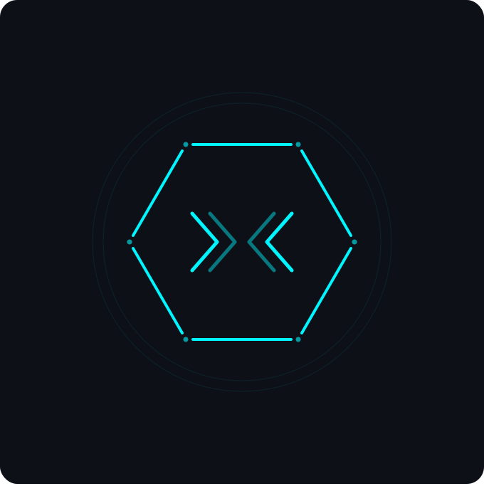

<div align="center">
  
  <h1>ShadowCrypt</h1>
  <p><strong>End-to-end encrypted messaging with a zero-knowledge relay</strong></p>

  [](LICENSE)
  [](https://react.dev)
  [](https://www.typescriptlang.org)
  [](https://supabase.com)
</div>

---

## Security model — what this app actually does

| Property | Implementation |
|---|---|
| **Message confidentiality** | Double Ratchet (X25519 + HKDF-SHA256 + AES-256-GCM) — per-message unique keys |
| **Forward secrecy** | Ratchet advances after every message; past keys are not recoverable |
| **Header privacy** | Envelope headers (ratchet public key, counters) encrypted with a shared header key derived from the initial X25519 exchange — relay cannot read metadata |
| **Zero-knowledge relay** | Server routes opaque ciphertext; messages deleted from relay after delivery |
| **At-rest encryption** | All DB columns (text, image keys) vault-wrapped with AES-256-GCM before write |
| **Key derivation** | Argon2id (64 MB / 3 iter) — resistant to GPU/ASIC brute-force |
| **Image encryption** | AES-256-GCM per-image key, generated client-side; key travels inside ratchet ciphertext; storage bucket is private, served via signed URLs |
| **Identity keys** | X25519 key pair generated in-browser; private key never leaves the device |
| **Password recovery** | BIP-39 12-word mnemonic (128-bit entropy); only its SHA-256 hash is stored server-side |

**Honest limitations:** no web app can block OS-level screen capture; capture deterrence raises friction but is not a security guarantee. The header key is static per session (not per ratchet step), which is simpler than Signal's full "sealed sender" but still opaque to a relay observer. See [SECURITY.md](SECURITY.md) for the full threat model including what ShadowCrypt does *not* protect against.

---

## What is ShadowCrypt?

ShadowCrypt is an **end-to-end encrypted** messaging app built on a **zero-knowledge relay**: the server routes opaque ciphertext between clients and never holds keys, plaintext, or anything that would allow decryption. All cryptographic operations happen entirely in the browser using the Web Crypto API and audited WebAssembly libraries.

- **End-to-end encrypted** messages using the Signal Protocol Double Ratchet (X25519 + HKDF-SHA256 + AES-256-GCM)
- **Encrypted headers** — ratchet metadata opaque to the relay operator
- **Vault encryption** of all local data with Argon2id-derived keys
- **BIP-39 mnemonic recovery** for password resets without server involvement
- **Zero plaintext at rest** — the Supabase database only ever stores opaque ciphertext

---

## Features

| Feature | Details |
|---|---|
| **End-to-End Encryption** | Double Ratchet (Signal Protocol) — per-message unique keys, full forward secrecy |
| **Header Encryption** | Ratchet envelope headers encrypted with shared header key — relay cannot read metadata |
| **Vault Encryption** | All local data (messages, contacts, sessions) encrypted with Argon2id + AES-256-GCM |
| **Real-time Messaging** | Supabase Realtime relay — ciphertext only, messages deleted after delivery |
| **Image Sharing** | AES-256-GCM encrypted image upload; key inside ratchet ciphertext; private bucket + signed URLs |
| **Reply & Quote** | Thread-aware reply with quoted message preview |
| **Contact Requests** | Accept/decline incoming requests; full block list management |
| **Recovery Phrase** | BIP-39 12-word mnemonic for password reset without email |
| **Password Strength** | zxcvbn-based strength estimation + live requirements checklist |
| **Dark / Light Mode** | System-aware theme with manual override |
| **Responsive** | Full desktop + mobile experience |
| **Notifications** | Anonymous push notifications — never reveals sender identity |

---

## Tech Stack

| Layer | Technology |
|---|---|
| **Frontend** | React 18, TypeScript, Vite, Tailwind CSS, shadcn/ui |
| **Cryptography** | Web Crypto API, hash-wasm (Argon2id), @scure/bip39 |
| **Backend** | Supabase (Postgres, Auth, Realtime, Storage, Edge Functions) |
| **Key Exchange** | X25519 (ECDH) |
| **Message Encryption** | Signal Protocol Double Ratchet (AES-256-GCM + HKDF-SHA256) |
| **Vault KDF** | Argon2id (v1) / PBKDF2-SHA256 @ 310k iterations (v0 legacy) |
| **Password Recovery** | BIP-39 (128-bit entropy, 12 words) |

---

## Quick Start

### Prerequisites

- Node.js >= 18
- pnpm >= 8
- A [Supabase](https://supabase.com) project

### 1. Clone & Install

```bash
git clone https://github.com/Forestritium/ShadowCrypt.git
cd ShadowCrypt
pnpm install
```

### 2. Configure Environment

Copy the template and fill in your Supabase credentials:

```bash
cp .env.example .env
```

```env
VITE_SUPABASE_URL=https://your-project-ref.supabase.co
VITE_SUPABASE_ANON_KEY=your-supabase-anon-key
VITE_APP_ID=your-app-id
```

### 3. Apply Database Migrations

```bash
supabase db push
# or apply each file in supabase/migrations/ in order
```

### 4. Deploy Edge Functions

```bash
supabase functions deploy delete-account
supabase functions deploy reset-password
```

### 5. Run Locally

```bash
pnpm dev
```

---

## Repository Structure

```
ShadowCrypt/
├── src/
│   ├── components/
│   │   ├── chat/          # Chat UI (Sidebar, ChatArea, dialogs)
│   │   ├── common/        # RouteGuard, PageMeta
│   │   └── ui/            # shadcn/ui primitives
│   ├── contexts/
│   │   ├── AuthContext.tsx   # Auth state, vault unlock, mnemonic management
│   │   └── ThemeContext.tsx  # Dark/light theme
│   ├── lib/
│   │   ├── crypto.ts         # AES-GCM, X25519, HKDF, PBKDF2, Argon2id
│   │   ├── doubleRatchet.ts  # Signal Protocol Double Ratchet + header encryption
│   │   ├── relay.ts          # Supabase messaging relay
│   │   ├── localStore.ts     # Encrypted IndexedDB vault
│   │   ├── dbStore.ts        # Supabase contacts & messages store
│   │   ├── session.ts        # Session lifecycle, key derivation
│   │   ├── mnemonic.ts       # BIP-39 utilities
│   │   └── zxcvbn.ts         # Password strength estimation
│   ├── pages/
│   │   ├── AuthPage.tsx      # Login, register, migrate, forgot password
│   │   ├── ChatPage.tsx      # Main chat interface
│   │   ├── SettingsPage.tsx  # Profile, bio, avatar, recovery phrase
│   │   └── PrivacyPolicyPage.tsx
│   └── types/types.ts        # Shared TypeScript types
├── supabase/
│   ├── functions/
│   │   ├── delete-account/   # Admin-privilege account deletion
│   │   └── reset-password/   # Mnemonic-verified password reset
│   └── migrations/           # Ordered SQL migration files
└── public/                   # Static assets
```

---

## Contributing

We welcome contributions! Please read [CONTRIBUTING.md](CONTRIBUTING.md) before opening a pull request.

---

## License

ShadowCrypt is licensed under the **GNU Affero General Public License v3.0**. See [LICENSE](LICENSE) for details.

> Under the AGPL, if you modify ShadowCrypt and run it as a network service, you must release your modifications under the same license.
